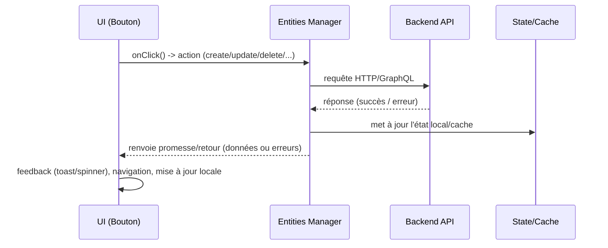

# UI Buttons – Guide complet

Ce dossier documente les composants de boutons exposés par `@components/ui/Button` et leur utilisation dans un flux **React + TypeScript** avec vos **Managers (entities)** pour communiquer avec le back‑end.

## Sommaire

- [Philosophie](#philosophie)
- [API commune](#api-commune)
- [Flux UI → Manager → Back‑end](#flux-ui--manager--back-end)
- [Exemples d’intégration](#exemples-dintégration)
- [Composants disponibles](#composants-disponibles)

---

## Philosophie

Chaque bouton est un **wrapper** autour de `UiButton` qui standardise :

- l’**iconographie**,
- l’**intent** (couleur/risque),
- les **props** communes (`label`, `size`, `variantType`, etc.),
- la **cohérence d’accessibilité** (aria-label/title).

Les variantes **`variantType="button"`** (avec label) et **`variantType="icon"`** (icône seule) sont supportées partout.

---

## API commune

```ts
type VariantType = "button" | "icon";

export type ButtonWrapperProps = {
    label?: string; // Texte visible (ou fallback ariaLabel)
    title?: string; // Astuce: si non fourni, le helper utilise label
    className?: string;
    sx?: SxProps<Theme>; // Styles MUI sx additionnels
    size?: MuiButtonProps["size"]; // "small" | "medium" | "large"
    variantType?: VariantType; // "button" (defaut) ou "icon"
    ariaLabel?: string; // pour icon; par défaut = label
};
```

Chaque bouton ajoute **une prop d’action** (ex: `onUpdate`, `onDelete`, etc.).  
Certains boutons acceptent `editColor?: string` pour surcharger la couleur de contour (mode outlined).

---

## Flux UI → Manager → Back‑end



**Recommandations :**

- Les fonctions d’actions (passées aux boutons) doivent être **idempotentes** et retourner une **Promise**.
- Centraliser l’erreur dans le Manager (ou via un hook) et remonter un message **signifiant** à l’UI.
- En mode _inline edit_, rassembler la logique d’édition (cancel/reset, save, back) dans un petit hook local qui orchestre les appels Manager.

---

## Exemples d’intégration

### 1) Édition inline d’un champ avec `UpdateButton` et `BackButton`

```tsx
import React from "react";
import { UpdateButton, BackButton } from "@components/ui/Button";
import type { FieldKey } from "@entities/core/hooks";
import { useEntityManager } from "@entities/core/manager"; // Exemple de hook Manager

type EditFieldProps<T extends Record<string, unknown>> = {
    editModeField: { field: FieldKey<T>; value: string };
    setEditModeField: React.Dispatch<
        React.SetStateAction<{ field: FieldKey<T>; value: string } | null>
    >;
    labels: (field: FieldKey<T>) => string;
    entityId: string;
};

export function EditField<T extends Record<string, unknown>>({
    editModeField,
    setEditModeField,
    labels,
    entityId,
}: EditFieldProps<T>) {
    const { update } = useEntityManager<T>();

    async function saveField() {
        if (!editModeField) return;
        await update(entityId, { [editModeField.field]: editModeField.value } as Partial<T>);
        setEditModeField(null);
    }

    const { field, value } = editModeField;

    return (
        <fieldset className="my-6 p-4 border rounded-md bg-white shadow-sm max-w-md mx-auto">
            <legend className="font-semibold text-lg mb-4">
                Modifier mon {labels(field).toLowerCase()} :
            </legend>

            <input
                className="w-full p-3 border border-gray-300 rounded-md focus:outline-none focus:ring-2 focus:ring-blue-500 transition"
                value={value}
                placeholder={labels(field)}
                title={labels(field)}
                onChange={(e) =>
                    setEditModeField((prev) => (prev ? { ...prev, value: e.target.value } : null))
                }
            />

            <div className="flex justify-between mt-5 gap-10">
                <UpdateButton onUpdate={saveField} label="Sauvegarder" className="flex-1 mr-2" />
                <BackButton
                    onBack={() => setEditModeField(null)}
                    label="Retour"
                    className="flex-1 ml-2"
                />
            </div>
        </fieldset>
    );
}
```

### 2) Suppression avec confirmation via Manager

```tsx
import { DeleteButton } from "@components/ui/Button";
import { useEntityManager } from "@entities/core/manager";

function RowActions({ id }: { id: string }) {
    const { remove } = useEntityManager<{ id: string }>();

    async function onDelete() {
        if (!confirm("Supprimer définitivement cet élément ?")) return;
        await remove(id);
    }

    return <DeleteButton onDelete={onDelete} variantType="icon" ariaLabel="Supprimer" />;
}
```

### 3) Création avec `SubmitButton`

```tsx
import { SubmitButton } from "@components/ui/Button";
import { useEntityManager } from "@entities/core/manager";

export function CreateTag() {
    const { create } = useEntityManager<{ name: string }>();
    const [name, setName] = React.useState("");

    async function onSubmit() {
        await create({ name });
        setName("");
    }

    return (
        <div className="flex gap-2">
            <input
                className="border p-2 rounded"
                value={name}
                onChange={(e) => setName(e.target.value)}
            />
            <SubmitButton onSubmit={onSubmit} label="Créer" />
        </div>
    );
}
```

---

## Composants disponibles

- [`UiButton`](UiButton.md)
- [`EditButton`](EditButton.md)
- [`DeleteButton`](DeleteButton.md)
- [`UpdateButton`](UpdateButton.md)
- [`CancelButton`](CancelButton.md)
- [`AddButton`](AddButton.md)
- [`BackButton`](BackButton.md)
- [`SubmitButton`](SubmitButton.md)
- [`ClearFieldButton`](ClearFieldButton.md)
- [`RefreshButton`](RefreshButton.md)
- [`PowerButton`](PowerButton.md)

> Voir chaque page pour l’API détaillée, les intents, et des exemples.
